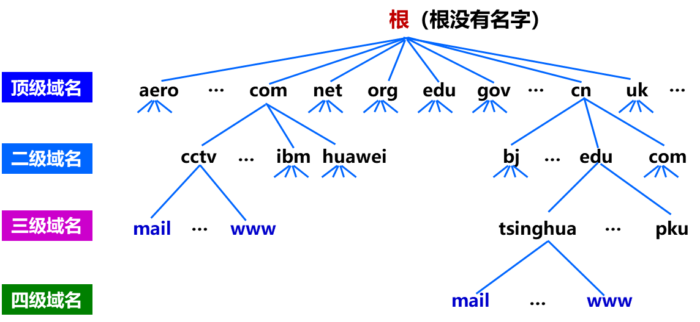
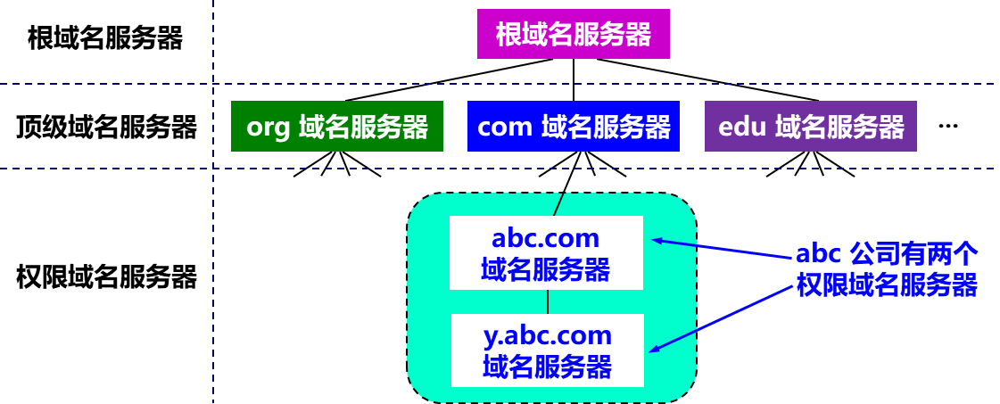
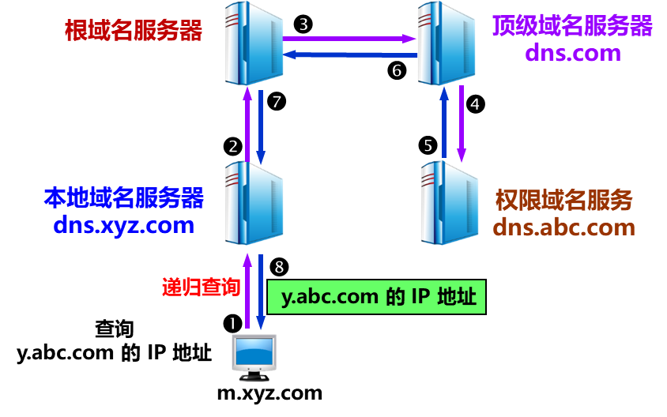
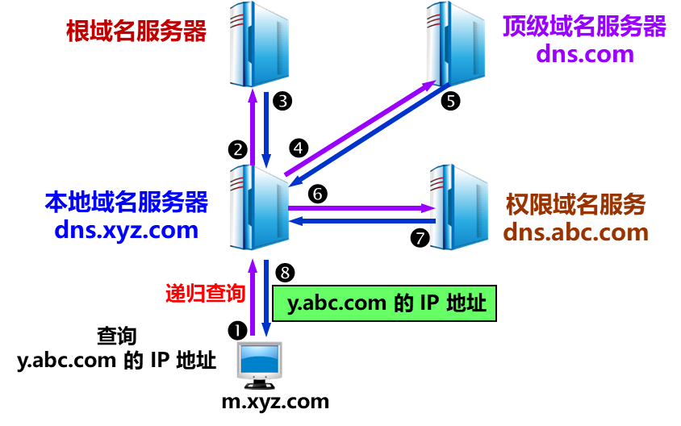

# 第六章 应用层

## 一、网络应用模型
1. 客户/服务器模型（C/S）
    - 客户机
      - 主动发出请求
    - 服务器
      - 一直运行
      - 被动接收请求
      - 提供服务
    - 网络中各计算机的地位不平等（用户权限）
    - 客户机之间不能直接通信
    - 客户机数量有限（受网络带宽和服务器硬件影响）

2. P2P 模型
    - 各计算机（对等方）没有固定的客户和服务器划分
    - 对等方直接相互通信
    - 可将任务分配到各个借点
    - 单个结点失效不会影响其他部分的结点
    - 占用较多内存，影响整机速度

## 二、域名系统 DNS
- 域名系统（DNS）
  - 是因特网使用的命名系统
  - 用来把便于人们记忆的具有特定含义的主机名，转换为便于机器处理的 IP 地址
  - 采用 客户/服务器模型
  - 端口号 53
  - 三部分
    - 层次域名空间
    - 域名服务器
    - 解析器

1. 层次域名空间（便于人们记忆的具有特定含义的主机名）
    - 因特网采用层次树状结构的命名方法
    - 域名
      - 任何连接到因特网的主机或路由器，都有一个唯一的层次结构名称
      - 由标号组成
        - 标号之间用“.”隔开
        - 标号英文不区分大小写
        - 每个标号不超过 63 个字符
        - 多标号组成的完整域名最长不超过 255 个字符
        - 域名级别从左到右依次升高
    - 域
      - 是一个可被管理的划分
      - 域可以被划分为子域
        - 子域还可以继续划分为子域的子域
          - 形成了顶级域、二级域、三级域  

        >www.mohanqing.com   
        www：三级域名    
        mohanqing：二级域名    
        com：顶级域名 

    

2. 域名服务器
    - 域名到 IP 地址的解析是由运行在域名服务器上的程序完成的
    - 区
      - 一个服务器所负责管辖的范围称为区
      - 一个区中的所有结点必须是能够连通的
      - 每个区设置相应的权限域名服务器
        - 用来保存该区中的所有主机的域名到 IP 地址的映射，完成域名到 IP 地址的解析
        - 并具有连向其他域名服务器的信息
          - 当自己不能进行域名解析时
          - 能够找到其他域名服务器
    - 有四种域名服务器
      1. 根域名服务器
          - 是最高层次的域名服务器
          - 所有的根域名服务器都知道所有的顶级域名服务器的域名和 IP 地址
          - 本地域名服务器只要无法对某个域名进行解析，就要首先求助于根域名服务器
          - 根域名服务器通常不进行域名解析，而是告诉本地域名服务器下一步应当找哪一个顶级域名服务器
      2. 顶级域名服务器
          - 管理该顶级域名服务器注册的所有二级域名
      3. 权限域名服务器（授权域名服务器）
          - 每台主机都必须在权限域名服务器处登记
          - 许多域名服务器都同时充当本地域名服务器和权限域名服务器
      4. 本地域名服务器
          - 当一台主机发出 DNS 查询请求时
            - 这个查询请求报文就发送给该主机的本地域名服务器

    

3. 域名解析过程
    - 当客户端需要域名解析时
      - 通过本机的 DNS 客户端构造一个 DNS 请求报文
      - 以 UDP 数据报的方式发往本地域名服务器
    - 域名解析有两种方式
      1. 递归查询
          - 主机向本地域名服务器的查询都采用递归查询
          - 本地域名服务器以 DNS 客户的身份，向根域名服务器继续发出查询报文
            - 而不是让该主机自己进行下一步的查询
      2. 迭代查询
          - 本地域名服务器向根域名服务器的查询通常是迭代查询
          - 当根域名服务器收到本地域名服务器发出的迭代查询请求报文时
            - 要么给出所要查询的 IP 地址
            - 要么返回下一步应当查询哪个顶级域名服务器进行查询
            - 然后让本地域名服务器进行后续的查询
          - 顶级域名服务器收到查询报文后同理
      - 本地域名服务器向其他域名服务器采用递归查询或迭代查询
          
      

