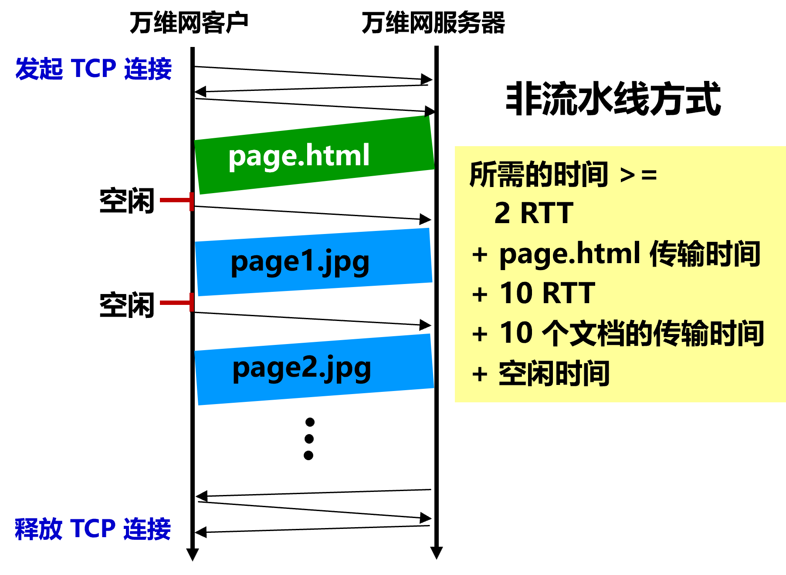
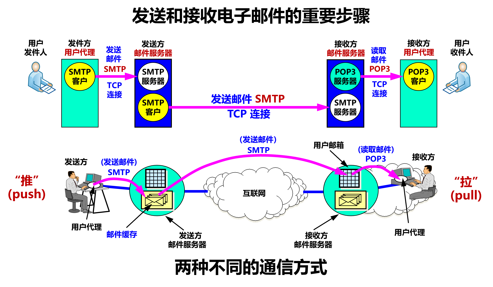
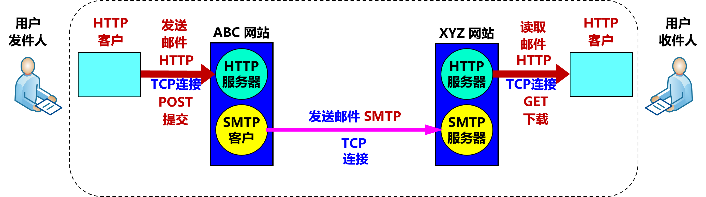
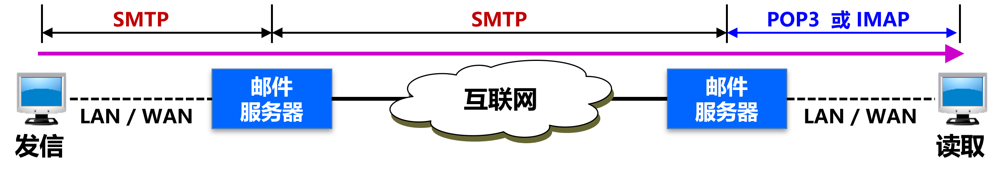

# 第六章 应用层

## 一、网络应用模型

1. 客户/服务器模型（C/S）
    - 客户机
      - 主动发出请求
    - 服务器
      - 一直运行
      - 被动接收请求
      - 提供服务
    - 网络中各计算机的地位不平等（用户权限）
    - 客户机之间不能直接通信
    - 客户机数量有限（受网络带宽和服务器硬件影响）

2. P2P 模型
    - 各计算机（对等方）没有固定的客户和服务器划分
    - 对等方直接相互通信
    - 可将任务分配到各个借点
    - 单个结点失效不会影响其他部分的结点
    - 占用较多内存，影响整机速度

## 二、域名系统 DNS

- 域名系统（DNS）
  - 是因特网使用的命名系统
  - 用来把便于人们记忆的具有特定含义的主机名，转换为便于机器处理的 IP 地址
  - 采用 客户/服务器模型
  - 端口号 53
  - 三部分
    - 层次域名空间
    - 域名服务器
    - 解析器

1. 层次域名空间（便于人们记忆的具有特定含义的主机名）
    - 因特网采用层次树状结构的命名方法
    - 域名
      - 任何连接到因特网的主机或路由器，都有一个唯一的层次结构名称
      - 由标号组成
        - 标号之间用“.”隔开
        - 标号英文不区分大小写
        - 每个标号不超过 63 个字符
        - 多标号组成的完整域名最长不超过 255 个字符
        - 域名级别从左到右依次升高
    - 域
      - 是一个可被管理的划分
      - 域可以被划分为子域
        - 子域还可以继续划分为子域的子域
          - 形成了顶级域、二级域、三级域  

        ><www.mohanqing.com>
        www：三级域名
        mohanqing：二级域名
        com：顶级域名

    

2. 域名服务器
    - 域名到 IP 地址的解析是由运行在域名服务器上的程序完成的
    - 区
      - 一个服务器所负责管辖的范围称为区
      - 一个区中的所有结点必须是能够连通的
      - 每个区设置相应的权限域名服务器
        - 用来保存该区中的所有主机的域名到 IP 地址的映射，完成域名到 IP 地址的解析
        - 并具有连向其他域名服务器的信息
          - 当自己不能进行域名解析时
          - 能够找到其他域名服务器
    - 有四种域名服务器
      1. 根域名服务器
          - 是最高层次的域名服务器
          - 所有的根域名服务器都知道所有的顶级域名服务器的域名和 IP 地址
          - 本地域名服务器只要无法对某个域名进行解析，就要首先求助于根域名服务器
          - 根域名服务器通常不进行域名解析，而是告诉本地域名服务器下一步应当找哪一个顶级域名服务器
      2. 顶级域名服务器
          - 管理该顶级域名服务器注册的所有二级域名
      3. 权限域名服务器（授权域名服务器）
          - 每台主机都必须在权限域名服务器处登记
          - 许多域名服务器都同时充当本地域名服务器和权限域名服务器
      4. 本地域名服务器
          - 当一台主机发出 DNS 查询请求时
            - 这个查询请求报文就发送给该主机的本地域名服务器

    

3. 域名解析过程
    - 当客户端需要域名解析时
      - 通过本机的 DNS 客户端构造一个 DNS 请求报文
      - 以 UDP 数据报的方式发往本地域名服务器
    - 域名解析有两种方式
      1. 递归查询
          - 主机向本地域名服务器的查询都采用递归查询
          - 本地域名服务器以 DNS 客户的身份，向根域名服务器继续发出查询报文
            - 而不是让该主机自己进行下一步的查询
      2. 迭代查询
          - 本地域名服务器向根域名服务器的查询通常是迭代查询
          - 当根域名服务器收到本地域名服务器发出的迭代查询请求报文时
            - 要么给出所要查询的 IP 地址
            - 要么返回下一步应当查询哪个顶级域名服务器进行查询
            - 然后让本地域名服务器进行后续的查询
          - 顶级域名服务器收到查询报文后同理
      - 本地域名服务器向其他域名服务器采用递归查询或迭代查询
      
      

## 三、文件传送协议 FTP

- 文件传送协议FTP
  - 提供交互式的访问，允许客户指明文件的类型与格式，并允许文件具有存取权限。
  - 屏蔽了各计算机系统的细节，适合于在异构网络中任意计算机之间传送文件。

1. FTP 的特点

    - 只提供文件传送的一些基本服务，它使用 TCP 可靠的运输服务。
    - 主要功能：减少或消除在不同操作系统下处理文件的不兼容性。
    - 使用客户服务器方式。
    - 一个 FTP 服务器进程可同时为多个客户进程提供服务。
    - FTP 的服务器进程由两大部分组成：
      - 一个主进程，负责接受新的请求；
      - 若干个从属进程，负责处理单个请求。

2. FTP 主进程的工作步骤

    - 打开熟知端口（端口号为 21），使客户进程能够连接上。
    - 等待客户进程发出连接请求。
    - 启动从属进程来处理客户进程发来的请求。
      - 从属进程对客户进程的请求处理完毕后即终止
      - 从属进程在运行期间根据需要还可能创建其他一些子进程。
    - 回到等待状态，继续接受其他客户进程发来的请求。
      - 主进程与从属进程的处理是并发地进行。
    

## 四、简单文件传送协议 TFTP

- 简单文件传送协议 TFTP
  - TFTP (Trivial File Transfer Protocol) 是一个很小且易于实现的文件传送协议。
  - 使用客户服务器方式和使用 UDP 数据报，因此 TFTP 需要有自己的差错改正措施。
  - 只支持文件传输，不支持交互。
  - 没有庞大的命令集，没有列目录的功能，也不能对用户进行身份鉴别。
  - 优点：（1）可用于 UDP 环境；（2）代码所占的内存较小。

1. TFTP 主要特点
    - 每次传送的数据报文中有 512 字节的数据（最后一次可以不足 512 字节）。
    - 数据报文按序编号，从 1 开始。
    - 支持 ASCII 码或二进制传送。
    - 可对文件进行读或写。
    - 使用很简单的首部。

2. 工作方式

    （类似停止等待协议）
    - 发送完一个文件块后就等待对方的确认，确认时应指明所确认的块编号。
    - 发完数据后在规定时间内收不到确认就要重发数据 PDU。
    - 发送确认 PDU 的一方若在规定时间内未收到下一个文件块，需重发确认 PDU，保证文件的传送不致因某一个数据报的丢失而告失败。

3. 工作过程

    - 开始工作时，TFTP 客户进程发送一个读请求或写请求报文给 TFTP 服务器进程，其 UDP 熟知端口号码为 69。
    - TFTP 服务器进程选择一个新的端口和 TFTP 客户进程进行通信。
    - 若文件长度恰好为 512 字节的整数倍，则在文件传送完毕后，还必须在最后发送一个只含首部而无数据的数据报文。
    - 若文件长度不是 512 字节的整数倍，则最后传送数据报文的数据字段一定不满 512 字节，作为文件结束的标志。

## 五、远程终端协议 TELNET

1. 远程终端协议 TELNET

    - 是一个简单的远程终端协议，是互联网的正式标准。
    - 允许用户在其所在地通过 TCP 连接注册（即登录）到远地的另一个主机上（使用主机名或 IP 地址）。
    - 能将用户的击键传到远地主机，同时也能将远地主机的输出通过 TCP 连接返回到用户屏幕。
    - 服务是透明的。
    - 又称为终端仿真协议。
    - 使用客户 - 服务器方式
      - 在本地系统运行 TELNET 客户进程，而在远地主机则运行 TELNET 服务器进程。
      - 服务器中的主进程等待新的请求，产生从属进程来处理每一个连接。
    - 使用网络虚拟终端 NVT 格式
      - TELNET 的选项协商 (Option Negotiation) 使客户和服务器可商定使用更多的终端功能，协商的双方是平等的。
      - 能够适应许多计算机和操作系统的差异
    

2. NVT（Network Virtual Terminal）格式

    - 客户端把用户的击键和命令转换成 NVT 格式，并送交服务器。
    - 服务器端把收到的数据和命令，从 NVT 格式转换成远地系统所需的格式。
    - 向客户返回数据时，服务器把远地系统的格式转换为 NVT 格式，本地客户再从 NVT 格式转换到本地系统所需的格式。
    - 格式定义：分两种字符集，数据字符和控制字符。
    

## 六、万维网 WWW

- 万维网 WWW (World Wide Web) ：一个大规模的、联机式的信息储藏所（并非某种特殊的计算机网络）。
- 是分布式超媒体 (hypermedia) 系统
- 是超文本 (hypertext) 系统的扩充。

1. 万维网的工作方式

    - 以客户服务器方式工作。
    - 客户程序：浏览器。
    - 服务器程序：在万维网文档所驻留的主机上运行。这个计算机也称为万维网服务器。
    - 客户程序向服务器程序发出请求，服务器程序向客户程序送回客户所要的万维网文档。
      - 在一个客户程序主窗口上显示出的万维网文档称为页面 (page)。

2. 万维网必须解决的问题

    - (1) 怎样标志分布在整个互联网上的万维网文档？
      - 使用统一资源定位符 URL (Uniform Resource Locator) 。
      - 使每一个文档在整个互联网的范围内具有唯一的标识符 URL。
    - (2) 用什么协议来实现万维网上的各种链接？
      - 使用超文本传送协议 HTTP (HyperText Transfer Protocol)。
      - HTTP 是一个应用层协议，使用 TCP 连接进行可靠的传送。
    - (3) 怎样使不同作者创作的不同风格的万维网文档都能在互联网上的各种主机上显示出来，同时使用户清楚地知道在什么地方存在着链接？
      - 使用超文本标记语言 HTML (HyperText Markup Language) 。
    - (4) 怎样使用户能够很方便地找到所需的信息？
      - 使用各种的搜索工具（即搜索引擎）。

## 七、统一资源定位符 URL

- 是对互联网上资源的位置和访问方法的一种简洁表示。
- 给资源的位置提供一种抽象的识别方法，并用这种方法给资源定位。
- 是在互联网上的资源的地址。
- 互联网上的所有资源，都有一个唯一确定的URL。

1. URL 的格式

    - 由以冒号（:）隔开的两大部分组成，对字符大写或小写没有要求。
    - 一般形式：<协议>://<主机>:<端口>/<路径>
      - <协议>
        - 指出以何种协议来获取该万维网文档
        - 常用协议：
          - ftp —— 文件传送协议 FTP
          - http —— 超文本传送协议 HTTP
      - <主机>
        - 存放资源的主机在互联网中的域名
        - 也可以是用点分十进制的 IP 地址。
      - <端口>
        - 端口号。省略时使用默认端口号。
      - <路径>
        - 资源所在目录位置。
        - 区分大小写。
        - 省略时使用所定义的默认路径。
        - 后面可能还有一些选项。

2. 使用 HTTP 的 URL

    - 常用形式（省略端口号）：http://<主机>/<路径>
      ><http://www.tsinghua.edu.cn/publish/newthu/newthu_cnt/faculties/index.html>
      主机域名：www.tsinghua.edu.cn
      路径名：publish/newthu/newthu_cnt/faculties/index.html

## 八、超文本传送协议 HTTP

- HTTP 是面向事务的 (transaction-oriented) 应用层协议。
- 使用 TCP 连接进行可靠的传送。
- 定义了浏览器与万维网服务器通信的格式和规则。
- 是万维网上能够可靠地交换文件的重要基础。

1. HTTP 的主要特点

    - HTTP 使用面向连接的 TCP 作为运输层协议，保证数据的可靠传输。
    - HTTP 协议本身是无连接的。
    - HTTP 是无状态的 (stateless)，简化了服务器的设计，使服务器更容易支持大量并发的 HTTP 请求。

2. HTTP 的操作过程

    

3. 请求一个万维网文档所需的时间

    - 所需的时间包含：
      - RTT（三报文握手建立 TCP 连接）
      - RTT（请求和接收文档）
      - 文档的传输时间
    - 等于（ 2 RTT +文档的传输时间 ）
    

4. 协议 HTTP/1.0 的主要缺点

    - 每请求一个文档就要有两倍 RTT 的开销。
    - 客户和服务器每一次建立新的 TCP 连接都要分配缓存和变量。
    - 这种非持续连接使服务器的负担很重。
        

5. 协议 HTTP/1.1 使用持续连接

    - 持续连接（persistent connection）：服务器在发送响应后仍然在一段时间内保持这条连接（不释放），使同一个客户（浏览器）和该服务器可以继续在这条连接上传送后续的 HTTP 请求报文和响应报文。
    - 只要文档都在同一个服务器上，就可以继续使用该 TCP 连接。
    - 两种工作方式：
      - 非流水线方式 (without pipelining)
        - 客户在收到前一个响应之后才能发出下一个请求。
        - 缺点：TCP 连接空闲状态。
      - 流水线方式 (with pipelining)。
        - 客户在收到响应报文之前就能够接着发送新的请求报文。
        - 连续的多个请求报文到达服务器后，服务器就可连续发回响应报文。
        - 下载效率提高。
    
    

6. 协议 HTTP/2

    - 是协议 HTTP/1.1 的升级版本。
    - 服务器可以并行发回响应（使用同一个 TCP 连接）。
    - 允许客户复用 TCP 连接进行多个请求。
    - 把所有的报文都划分为许多较小的二进制编码的帧，并采用了新的压缩算法，不发送重复的首部字段，大大减小了首部的开销，提高了传输效率。
    - 向后兼容。

7. HTTP 的报文结构

    - 两类报文：
      - 请求报文：从客户向服务器的请求。
      - 响应报文：从服务器到客户的回答。
      - 由于 HTTP 是面向正文的 (text-oriented)，因此报文中每一个字段的值都是一些 ASCII 码串，每个字段的长度都是不确定的。
    - 三个组成部分：
      - 开始行：用于区分是请求报文（请求行）还是响应报文（状态行）。
      - 首部行：说明浏览器、服务器或报文主体的一些信息。可以有多行，也可以不使用。
      - 实体主体：请求报文中一般不用，响应报文中也可能没有该字段。
    
    
    - HTTP 请求报文的一些方法
      |方法（操作）|意义|
      |---|---|
      |OPTION|请求一些选项的信息|
      |GET|请求读取由 URL所标志的信息|
      |HEAD|请求读取由 URL所标志的信息的首部|
      |POST|给服务器添加信息（例如，注释）|
      |PUT|在指明的 URL下存储一个文档|
      |DELETE|删除指明的 URL所标志的资源|
      |TRACE|用来进行环回测试的请求报文|
      |CONNECT|用于代理服务器|
    - 响应报文的状态码：都是三位数字，分为5大类
      - 1xx 表示通知信息，如请求收到了或正在进行处理。
      - 2xx 表示成功，如接受或知道了。
      - 3xx 表示重定向，表示要完成请求还必须采取进一步的行动。
      - 4xx 表示客户的差错，如请求中有错误的语法或不能完成。
      - 5xx 表示服务器的差错，如服务器失效无法完成请求。

## 九、电子邮件

1. 电子邮件
    - 主要构件
      - 用户代理
        - 用户与电子邮件系统的接口。
        - 又被称为电子邮件客户端软件。
        - 基本功能：撰写、显示、处理、通信。
      - 邮件服务器
        - 又被称为邮件传输代理。
        - 功能：发送和接收邮件，同时还要向发信人报告邮件传送的情况。
        - 按照客户服务器方式工作。
        - 邮件服务器必须能够同时充当客户和服务器。
      - 邮件发送和读取协议
        - 邮件发送和读取使用不同的协议。
        - 简单邮件发送协议 SMTP：用于在用户代理向邮件服务器 或 邮件服务器之间发送邮件。
        - 邮局协议 POP3：用于用户代理从邮件服务器读取邮件。
        - SMTP 和 POP3（或 IMAP）都使用 TCP 连接可靠地传送邮件。
    - 电子邮件的组成
      - 信封
        - 电子邮件的传输程序根据邮件信封上的信息来传送邮件。
      - 内容
        - 用户在从自己的邮箱中读取邮件时才能见到邮件的内容
        - 分为首部和主体
        - 首部中最重要的关键字：To 和 Subject
    - 邮件地址的格式
      - 收件人邮箱名@邮件服务器的域名
        ><xiexiren@tsinghua.org.cn>
        xiexiren：这个用户名在该域名的范围内是唯一的。
        tsinghua.org.cn：邮箱所在的主机的域名，在全世界必须是唯一的

    

2. 基于万维网的电子邮件
    - 用户代理 (UA) 的缺点：
      - 必须在计算机中安装用户代理软件。
      - 收发邮件不方便。
    - 万维网电子邮件优点：
      - 不需要在计算机中再安装用户代理软件。
      - 计算机能联网，就能非常方便地收发电子邮件。
      - 界面非常友好。
    - 发送、接收电子邮件时使用 HTTP 协议。
      - 使用 HTTP POST 方法提交要发送的邮件。
      - 使用 HTTP GET 方法读取邮件。
    - 两个邮件服务器之间传送邮件时使用 SMTP。
    

## 十、简单邮件传送协议 SMTP

- SMTP 规定了在两个相互通信的 SMTP 进程之间交换信息的方法。
- SMTP 使用客户服务器方式。
- SMTP 基于 TCP 实现客户与服务器的通信。
- SMTP 不使用中间的服务器

1. SMTP 通信的三个阶段

    - 连接建立：在发送主机的 SMTP 客户和接收主机的 SMTP 服务器之间建立连接。不使用中间的邮件服务器。
    - 邮件传送
    - 连接释放：邮件发送完毕后，SMTP 应释放 TCP 连接。

2. 缺点
    - 不能传送可执行文件或其他的二进制对象。
    - 限于传送 7 位的 ASCII 码，无法传送非 ASCII 编码的信息。
    - 服务器会拒绝超过一定长度的邮件。
    - 某些 SMTP 的实现并没有完全按照 [RFC 821] 的 SMTP 标准。
    - 可以通过 通用互联网邮件扩充 MIME 解决以上缺点

## 十一、邮件读取协议 POP3 和 IMAP

- 邮件读取协议 POP 或 IMAP 与邮件传送协议 SMTP 完全不同。
- 发信人的用户代理向源邮件服务器发送邮件，以及源邮件服务器向目的邮件服务器发送邮件，都是使用 SMTP 协议。
- POP 协议或 IMAP 协议则是用户从目的邮件服务器上读取邮件所使用的协议。

1. POP3 协议
    - POP3 使用客户服务器方式。
    - POP3 基于 TCP 实现客户与服务器的通信。
    - POP3 支持用户鉴别。
    - POP3 服务器删除被用户读取了的邮件。

2. IMAP 协议
    - IMAP 使用客户服务器方式。
    - IMAP 基于 TCP 实现客户与服务器的通信。
    - IMAP 是一个联机协议。
    - 特点
      - 连接后只下载邮件首部（部分下载）。
      - 用户直接在 IMAP 服务器上创建和管理文件夹。
      - 用户可以搜索邮件内容。
      - 用户可以在不同的地方使用不同的计算机随时上网阅读和处理自己的邮件。
      - 允许收信人只读取邮件中的某一个部分。
    - 缺点：要想查阅邮件，必须先联网。

3. IMAP 与 POP3 比较

    |操作位置|操作内容|IMAP|POP3|
    |---|---|---|---|
    |收件箱|阅读、标记、移动、删除邮件等|客户端与邮箱更新同步|仅在客户端内|
    |发件箱|保存到已发送|客户端与邮箱更新同步|仅在客户端内|
    |创建文件夹|新建自定义的文件夹|客户端与邮箱更新同步|仅在客户端内|
    |草稿|保存草稿|客户端与邮箱更新同步|仅在客户端内|
    |垃圾文件夹|接收并移入垃圾文件夹的邮件|支持|不支持|
    |广告邮件|接收并移入广告邮件夹的邮件|支持|不支持|

## 十二、动态主机配置协议 DHCP

- 动态主机配置协议 DHCP (Dynamic Host Configuration Protocol) 提供了即插即用连网 (plug-and-play networking) 的机制，允许一台计算机加入网络和获取 IP 地址，而不用手工配置。
- DHCP 给运行服务器软件、且位置固定的计算机指派一个永久地址，给运行客户端软件的计算机分配一个临时地址。

1. DHCP 工作方式
    - DHCP 使用客户服务器方式，采用请求/应答方式工作。
      - 需要 IP 地址的主机向 DHCP 服务器广播发送发现报文 。
      - DHCP 服务器回答提供报文 (DHCPOFFER) （单播），提供 IP 地址等配置信息。
    - DHCP 基于 UDP 工作，DHCP 服务器运行在 67 号端口， DHCP客户运行在 68 号端口。
    - 不需要在每个网络上都设置 DHCP 服务器。
    - 每一个网络至少有一个 DHCP 中继代理，它配置了 DHCP 服务器的 IP 地址信息。
      - DHCP 中继代理收到主机广播发送的发现报文后，就以单播方式向 DHCP 服务器转发此报文，并等待其回答。
      - 收到 DHCP 服务器回答的提供报文后，DHCP 中继代理再将其发回给主机。

2. 租用期 (lease period)
    - DHCP 服务器分配给 DHCP 客户的 IP 地址的临时的，因此 DHCP 客户只能在一段有限的时间内使用这个分配到的 IP 地址。DHCP 协议称这段时间为租用期。
    - 租用期的数值应由 DHCP 服务器自己决定。
    - DHCP 客户也可在自己发送的报文中（例如，发现报文）提出对租用期的要求。

3. DHCP 协议的工作过程
    1. DHCP 服务器被动打开 UDP 端口 67，等待客户端发来的报文。
    2. DHCP 客户从 UDP 端口 68 发送 DHCP 发现报文 DHCPDISCOVER。
    3. 凡收到 DHCP 发现报文的 DHCP 服务器都发出 DHCP 提供报文 DHCPOFFER，因此 DHCP 客户可能收到多个 DHCP 提供报文。
    4. DHCP 客户从几个 DHCP 服务器中选择其中的一个，并向所选择的 DHCP 服务器发送 DHCP 请求报文 DHCPREQUEST。
    5. 被选择的 DHCP 服务器发送确认报文 DHCPACK，DHCP 客户可开始使用得到的临时 IP 地址了，进入已绑定状态。
      DHCP 客户现在要根据服务器提供的租用期 T 设置两个计时器 T1 和 T2，它们的超时时间分别是 0.5T 和 0.875T。当超时时间到时，就要请求更新租用期。
    6. 租用期过了一半（T1 时间到），DHCP 发送请求报文 DHCPREQUEST，要求更新租用期。
    7. DHCP 服务器若同意，则发回确认报文 DHCPACK。DHCP 客户得到了新的租用期，重新设置计时器。
    8. DHCP 服务器若不同意，则发回否认报 DHCPNACK。这时 DHCP 客户必须立即停止使用原来的 IP 地址，而必须重新申请 IP 地址（回到步骤 2 ）。
      若 DHCP 服务器不响应步骤 6 的请求报文 DHCPREQUEST，则在租用期过了 87.5% 时 (T2 时间到)，DHCP 客户必须重新发送请求报文 DHCPREQUEST（重复步骤 6 ），然后又继续后面的步骤。
    9. DHCP 客户可随时提前终止服务器所提供的租用期，这时只需向 DHCP 服务器发送释放报文 DHCPRELEASE 即可。
    
